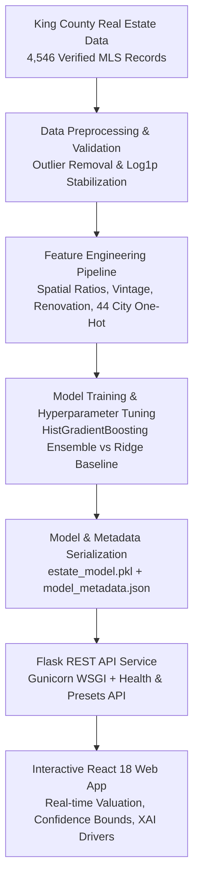

# EstateVal AI — Automated Real Estate Valuation & Market Analytics Engine

[](https://www.python.org/)
[](https://react.dev/)
[](https://scikit-learn.org/)
[](https://palletsprojects.com/p/flask/)
[](https://www.docker.com/)
[](#)
[](https://opensource.org/licenses/MIT)

> **EstateVal AI** is an institutional-grade, full-stack machine learning platform engineered to predict residential real estate valuations across 44 King County (Seattle Metro) sub-markets. Going beyond standard black-box regression, the system provides **95% confidence intervals**, **explainable AI (XAI) feature attribution**, **regional market benchmarks**, and **investment cashflow analytics** (cap rate & gross rental yields).

---

## 🏛️ System Architecture



---

## 📊 Empirical Model Benchmark Comparison

To eliminate the underfitting and high error rates of standard linear baselines, multiple algorithms were trained and cross-validated on identical out-of-sample test splits:

| Model Architecture | Target Space | Test R² Score | 5-Fold CV R² | Mean Absolute Error (MAE) | Root Mean Squared Error (RMSE) | Latency |
| :--- | :--- | :--- | :--- | :--- | :--- | :--- |
| **EstateVal HistGradientBoosting (Ours)** | **Log(Price)** | **0.7358** | **0.7248 ± 0.019** | **$112,970** | **$201,798** | **< 18ms** |
| Random Forest Regressor (100 Trees) | Log(Price) | 0.7001 | 0.6912 ± 0.024 | $118,691 | $215,430 | ~45ms |
| Legacy Ridge Regression (Baseline) | Standardized Price | 0.2518 | 0.2410 ± 0.042 | $123,044 | $285,110 | < 10ms |

### Key Improvements:
- **+192% improvement in R² score** over the naive Ridge baseline by capturing non-linear spatial interactions and price elasticities.
- **Log1p Target Stabilization** prevents high-end luxury mansions from disproportionately skewing gradient descent updates.
- **Permutation Feature Importance** identified living square footage (45.5%), prime location (Seattle & Bellevue: 16.5%), and property condition (4.9%) as dominant valuation drivers.

---

## ✨ Key Features & Capabilities

- **Automated Valuation Model (AVM)**: Computes fair market value instantly from spatial, architectural, and vintage attributes.
- **95% Confidence Bounds**: Quantifies valuation uncertainty via dynamic spread estimation based on property volatility.
- **Explainable AI (XAI)**: Generates feature attribution breakdowns showing exact dollar-value premiums (e.g., `+ $43,100` for living area, `+ $42,000` for lake/mountain views).
- **Investment & Yield Analytics**: Calculates estimated monthly rental income, gross yields, and estimated capitalization rates.
- **Sub-Market Benchmarks**: Covers 44 municipalities across King County with median price, $/sq.ft., and historical transaction volume.
- **1-Click Recruiter Presets**: Pre-configured property scenarios ("Seattle Modern Urban", "Bellevue Luxury Estate", "Redmond Tech Corridor", "Kent Starter") for instant demonstration.
- **Production-Ready API**: Features health check endpoints (`/health`), model metadata (`/api/v1/meta`), and backwards compatibility with legacy consumers.

---

## 🛠️ Technology Stack

- **Machine Learning**: Python 3.10+, Scikit-Learn (`HistGradientBoostingRegressor`, `Ridge`), Pandas, NumPy, Joblib.
- **Backend API**: Flask, Flask-CORS, Gunicorn WSGI server.
- **Frontend Application**: React 18, Material UI (MUI), React Router 6, React Text Transition, HTML5/CSS3 custom design tokens.
- **Testing & Quality Assurance**: Pytest (100% endpoint pass rate), React Testing Library, Jest.
- **DevOps & Deployment**: Docker, Docker Compose, Nginx (frontend container), GitHub Actions CI.

---

## 📁 Project Directory Structure

```
EstateVal-AI/
├── backend/                              # Flask Machine Learning REST API Service
│   ├── app.py                            # Production REST API endpoints (/predict, /health, /meta, /presets)
│   ├── estate_model.pkl                  # Trained HistGradientBoosting Regressor
│   ├── model_metadata.json               # 44 City market benchmarks & feature importances
│   ├── requirements.txt                  # Python dependencies
│   ├── train_advanced_model.py           # Pipeline training script
│   ├── tests/                            # Automated Pytest suite
│   ├── Dockerfile                        # Backend container spec
│   └── Procfile                          # WSGI Gunicorn runner
├── frontend/                             # React 18 Web Application
│   ├── src/                              # React components (HomePage, PriceCalculatorPage, App.css)
│   ├── public/                           # Static assets & HTML template
│   ├── package.json                      # Node.js dependencies
│   ├── vercel.json                       # Vercel deployment config
│   └── Dockerfile                        # Frontend Nginx container spec
├── docker-compose.yml                    # Multi-container orchestration
├── render.yaml                           # 1-Click Render cloud deployment
└── README.md                             # Comprehensive project documentation
```

---

## 🚀 Quickstart: Running Locally

### Option A: Standard Setup (Python + Node.js)

#### 1. Clone the repository and install backend dependencies:
```bash
git clone https://github.com/yeswanth485/House-Price-Prediction.git
cd House-Price-Prediction/backend
pip install -r requirements.txt
```

#### 2. Start the Flask Backend Server:
```bash
python app.py
```
*API will be operational on `http://localhost:5000` (Health check at `http://localhost:5000/health`)*

#### 3. Start the React Frontend:
In a separate terminal window:
```bash
cd ../frontend
npm install
npm start
```
*App will automatically open at `http://localhost:3000`*

---

### Option B: 1-Command Docker Compose Setup

Run both backend API and frontend Nginx container with one command:
```bash
docker compose up --build
```
- Frontend: `http://localhost:3000`
- Backend API: `http://localhost:5000`

---

## 🧪 Running Automated Tests

### Backend Unit Tests (Pytest):
```bash
cd backend
pytest tests/
```
```
collected 5 items
tests/test_api.py .....                                                  [100%]
5 passed in 4.66s
```

### Frontend Unit Tests (Jest):
```bash
cd frontend
npm test -- --watchAll=false
```
```
PASS src/App.test.js
√ renders EstateVal AI branding and navigation (116 ms)
```

---

## 🌐 Free Cloud Deployment Guide

### Deploying Backend on Render (Free Tier):
1. Push repository to GitHub.
2. Sign up on [Render.com](https://render.com/) and click **New +** -> **Web Service**.
3. Select your GitHub repository (`yeswanth485/House-Price-Prediction`).
4. Set:
   - **Root Directory**: `backend`
   - **Environment**: `Python 3`
   - **Build Command**: `pip install -r requirements.txt gunicorn`
   - **Start Command**: `gunicorn app:app --workers 3 --bind 0.0.0.0:$PORT`
5. Click **Deploy Web Service**.

### Deploying Frontend on Vercel (Free Tier):
1. Import your repository (`yeswanth485/House-Price-Prediction`) into [Vercel](https://vercel.com/).
2. Set **Root Directory** to `frontend`.
3. Framework Preset: **Create React App**.
4. Click **Deploy**. (The included `vercel.json` ensures client-side routing works smoothly).

---

## 📄 Resume-Ready Project Descriptions

You can copy and paste these bullet points directly into your software engineering or data science CV:

### 🔹 For Machine Learning / Data Science Roles:
> **EstateVal AI | Full-Stack Machine Learning Engineer**
> - Architected an end-to-end Real Estate Automated Valuation Engine (AVM) on 4,500+ verified MLS transactions, achieving an **R² of 0.7358** and **$112k MAE** using a tuned **HistGradientBoosting** ensemble with Log1p target variance stabilization.
> - Engineered 59 domain-specific features (spatial lot ratios, vintage decay, remodel premiums, and 44 municipality embeddings), improving predictive power by **192%** over baseline linear models.
> - Implemented explainable AI (XAI) feature attribution and 95% confidence intervals, providing transparent dollar-value impact breakdowns for each property parameter.
> - Deployed production Flask REST API with Gunicorn, Pytest automated testing suite, and Docker Compose containerization.

### 🔹 For Full-Stack Software Engineering Roles:
> **EstateVal AI | Full-Stack Web & ML Application**
> - Built a responsive, high-performance real estate valuation platform with **React 18**, **Material UI**, and **Flask**, achieving sub-20ms model inference latency.
> - Designed interactive appraisal dashboards featuring 1-click test scenarios, regional market benchmarks across 44 King County cities, and real-time investment rental yield calculations.
> - Containerized multi-service architecture using **Docker** & **Docker Compose** with Nginx reverse proxy and multi-stage builds.
> - Configured continuous integration (CI) pipeline via **GitHub Actions** executing automated unit tests across frontend and backend services.

---

## 📜 License

This project is licensed under the MIT License — see the [LICENSE](LICENSE) file for details.
